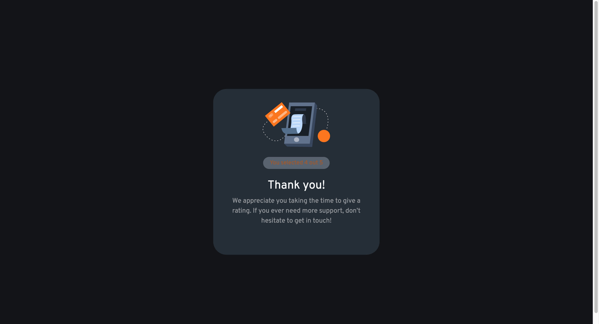

# Frontend Mentor - Interactive rating component solution

This is a solution to the [Interactive rating component challenge on Frontend Mentor](https://www.frontendmentor.io/challenges/interactive-rating-component-koxpeBUmI). Frontend Mentor challenges help you improve your coding skills by building realistic projects.

## Table of contents

- [Overview](#overview)
  - [The challenge](#the-challenge)
  - [Screenshot](#screenshot)
  - [Links](#links)
- [My process](#my-process)
  - [Built with](#built-with)
  - [What I learned](#what-i-learned)
- [Author](#author)

## Overview

### The challenge

Users should be able to:

- View the optimal layout for the app depending on their device's screen size
- See hover states for all interactive elements on the page
- Select and submit a number rating
- See the "Thank you" card state after submitting a rating

### Screenshot




### Links

- Solution URL: [Github Solution](https://github.com/morcicek/interactive-component)
- Live Site URL: [Interactive Component](https://incomparable-granita-a4ae87.netlify.app/)

## My process

### Built with

- Bootstrap
- CSS custom properties
- React Hooks
- [React](https://reactjs.org/) - JS library

### What I learned

I learned how to use React Hooks effectively.Also I reinforced the knowledge about bootstrap.

```html
<h1>Some HTML code I'm proud of</h1>
```

```css
body {
  background: hsl(216, 12%, 8%);
  font-family: 'Overpass', sans-serif;
}
.circle {
  background: hsl(216, 12%, 54%);
  border-radius: 50%;
  padding: 10px;
  font-size: 18px;
  width: 3rem;
  height: 3rem;
  opacity: 0.5;
  cursor: pointer;
  color: hsl(0, 0%, 100%);
}

.circle:hover {
  background: hsl(25, 97%, 53%);
  color: hsl(0, 0%, 100%);
  opacity: 1;
}

.circle:active {
  background: hsl(216, 12%, 54%);
}

.radius {
  border-radius: 2rem;
}

.primary {
  background: hsl(25, 97%, 53%);
  color: hsl(0, 0%, 100%);
}

.primary:hover {
  background: hsl(0, 0%, 100%);
  color: hsl(25, 97%, 53%);
}

.form-card {
  background: hsl(213, 19%, 18%);
  border-radius: 2rem;
  height: 25rem;
  padding: 2rem;
}

.width {
  width: 25rem;
}

.img-radius {
  background-color: hsl(216, 12%, 54%);
  opacity: 0.8;
  border-radius: 50%;
  padding: 1rem;
}

.opacity {
  opacity: 0.5;
}

.select {
  display: inline-block;
  background: hsl(216, 12%, 54%);
  opacity: 0.6;
  padding: 4px;
  font-size: 14px;
  width: 10rem;
  border-radius: 1rem;
  color: hsl(25, 97%, 53%);
}

[type='radio'] {
  opacity: 0;
}

.btn-check:checked + label {
  background: hsl(25, 97%, 53%);
  opacity: 1;
}
```

```js
import { useState } from 'react';
import './App.css';
import './scss/main.scss';
import 'bootstrap/dist/css/bootstrap.min.css';
import RatingForm from './components/RatingForm';
import Card from './components/Card';
import Header from './components/Header';
import ThanksPage from './components/ThanksPage';

function App() {
  const [rating, setRating] = useState(4);
  const [submit, setSubmit] = useState(true);
  const handleSubmit = (e) => {
    e.preventDefault();
    setSubmit(false);
  };
  return (
    <div className="container d-flex justify-content-center align-items-center vh-100 mt-4">
      {submit && (
        <Card>
          <Header />
          <RatingForm
            onSubmit={handleSubmit}
            select={(rating) => setRating(rating)}
          />
        </Card>
      )}
      {!submit && <ThanksPage rating={rating} />}
    </div>
  );
}

export default App;
```

## Author

- Github - [morcicek](https://github.com/morcicek)
- Linkedin - [Mehmet Cevat Morcicek](https://linkedin.com/in/mehmet-cevat-morcicek-b50a29178)
- Twitter - [@morcicek_m](https://twitter.com/morcicek_m)
- Fronend Mentor - [@morcicek](https://www.frontendmentor.io/profile/morcicek)
